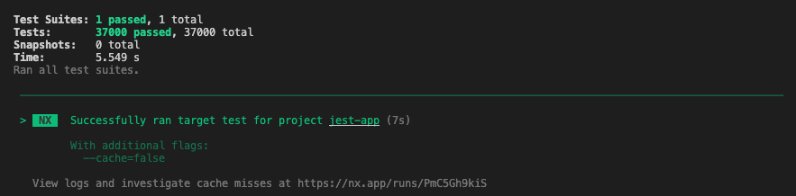
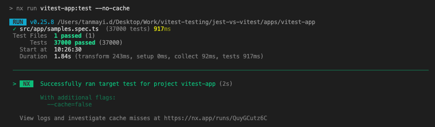
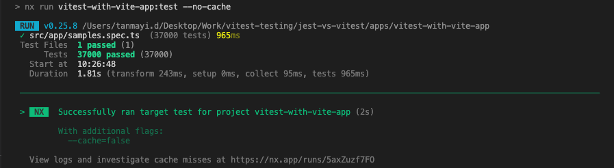
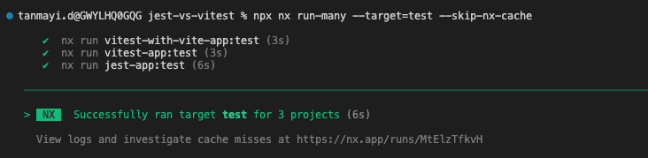
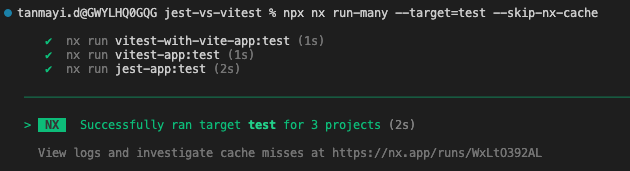

# Execution Time

- Number of test cases added : 37
- Each test case runs 1000 times

## Webpack + Jest Application

| Trial | Test Execution | Execution with No Cache Flag | Test Execution (--skip-nx-cache) | Watch Mode |
| :---- | :------------: | :--------------------------: | :------------------------------: | :--------: |
| 1     |     7.902s     |            6.945s            |             7.786 s              |   6.855s   |
| 2     |     7.902s     |            7.055s            |             7.961 s              |   8.594s   |
| 3     |     7.902      |            6.958s            |             8.245 s              |   8.415s   |

## Webpack + Vitest Application

| Trial | Test Execution | Execution with No Cache Flag | Test Execution (--skip-nx-cache) | Watch Mode |
| :---- | :------------: | :--------------------------: | :------------------------------: | :--------: |
| 1     |     1.83s      |            1.84s             |              1.84s               |   1.79s    |
| 2     |     1.83s      |            1.82s             |              1.81s               |   1.78s    |
| 3     |     1.83s      |            1.82s             |              1.75s               |   1.79s    |

## Vite + Vitest Application

| Trial | Test Execution | Execution with No Cache Flag | Test Execution (--skip-nx-cache) | Watch Mode |
| :---- | :------------: | :--------------------------: | :------------------------------: | :--------: |
| 1     |     1.81s      |            1.81s             |              1.89s               |   1.76s    |
| 2     |     1.81s      |            1.85s             |              1.81s               |   1.87s    |
| 3     |     1.81s      |            1.82s             |              1.82s               |   1.77s    |

# Running tests independently for each app

## jest with webpack app

app : jest-app
command : `npx nx test jest-app --no-cache --skip-nx-cache`

## vitest with webpack app

app : vitest-app
command : `npx nx test vitest-app --no-cache --skip-nx-cache`

## vitest with vite app

app : vitest-with-vite-app
command : `npx nx test vitest-with-vite-app --no-cache --skip-nx-cache`

# Running tests in Parallel for all projects with no-cache

- reference : https://nx.dev/packages/nx/documents/run-many
- command : `npx nx run-many --target=test --skip-nx-cache`

## Running 37000 tests for each app in parallel

## Sum function with 10 test cases

## Commands

Run Mode:

- `npx nx test jest-app`
- `npx nx test vitest-app run`
- `npx nx test vitest-with-vite-app run`

Run Mode with no cache:

- `npx nx test jest-app --no-cache --skip-nx-cache` (--watchAll : jest - if you want to watch all the cases)
- `npx nx test vitest-app run --no-cache --skip-nx-cache`
- `npx nx test vitest-with-vite-app run --no-cache --skip-nx-cache`

Watch Mode:

- `npx nx test jest-app --watch --no-cache --skip-nx-cache`
- `npx nx test vitest-app watch --no-cache --skip-nx-cache`
- `npx nx test vitest-with-vite-app watch --no-cache --skip-nx-cache`

## References

- [test.each vitest](https://vitest.dev/api/)
- [nx run-many](https://nx.dev/packages/nx/documents/run-many)
- [vitest - watch mode, run mode](https://vitest.dev/guide/features.html#watch-mode)
  - vitest starts in watch mode by default in development environment and run mode in CI environment (when process.env.CI presents) smartly. You can use vitest watch or vitest run to explicitly specify the desired mode.
- [test.each usage](https://dev.to/bgord/simplify-repetitive-jest-test-cases-with-test-each-310m)
